# Overview of Augmentation techniques


We present the different techniques that can be applied to augment a dataset of images. In order to generate the samples presented in this section, it is necessary to load some libraries.

```python
from clodsa.techniques.techniqueFactory import createTechnique
import cv2
import numpy as np

img = cv2.imread("images/cat1.jpg")
```

## Average blurring


Smoothes the image using an average filter. 

```python
t = createTechnique("average_blurring", {"kernel" : 5})
img1 = t.apply(img)
cv2.imwrite("average_blurring.jpg",np.hstack([img,img1]))
```


## Bilateral blurring


Applies bilateral blurring to the image. 

```python
t = createTechnique("bilateral_blurring", {"diameter" : 11, "sigmaColor": 21, "sigmaSpace":7})
img1 = t.apply(img)
cv2.imwrite("bilateral_blurring.jpg",np.hstack([img,img1]))
```

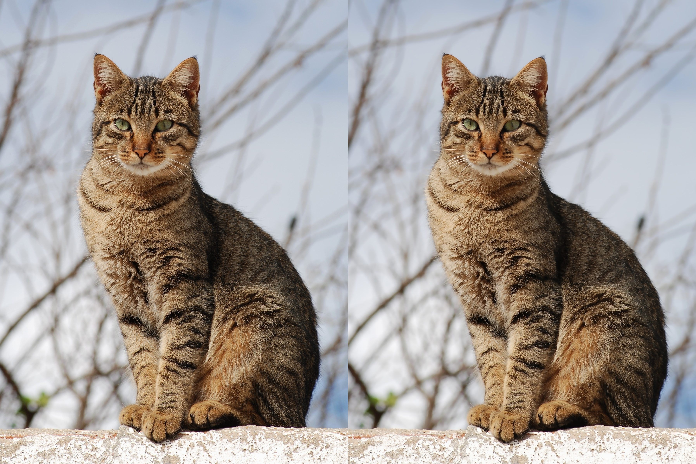


## Blurring


Blurs an image using the normalized box filter.

```python
t = createTechnique("blurring", {"ksize" : 5})
img1 = t.apply(img)
cv2.imwrite("blurring.jpg",np.hstack([img,img1]))
```


## Change to HSV


Changes the color space from RGB to HSV. 

```python
t = createTechnique("change_to_hsv",{})
img1 = t.apply(img)
cv2.imwrite("change_to_hsv.jpg",np.hstack([img,img1]))
```

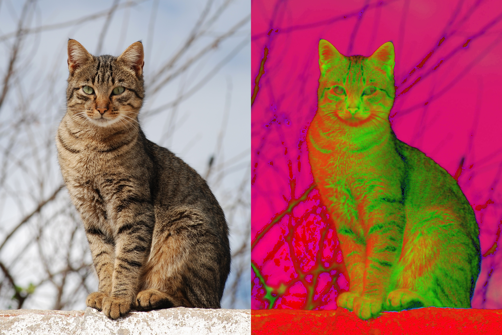


## Change to LAB


Changes the color space from RGB to LAB. 

```python
t = createTechnique("change_to_lab",{})
img1 = t.apply(img)
cv2.imwrite("change_to_lab.jpg",np.hstack([img,img1]))
```

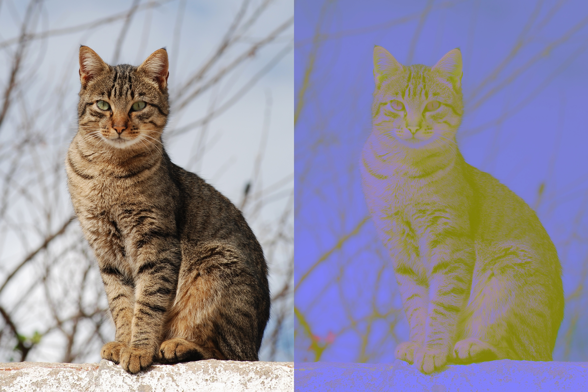


## Crop


Crops pixels at the sides of the image.

```python
t = createTechnique("crop",{"percentage":0.8,"startFrom": "TOPLEFT"})
img1 = t.apply(img)
cv2.imwrite("crop.jpg",img1)
```

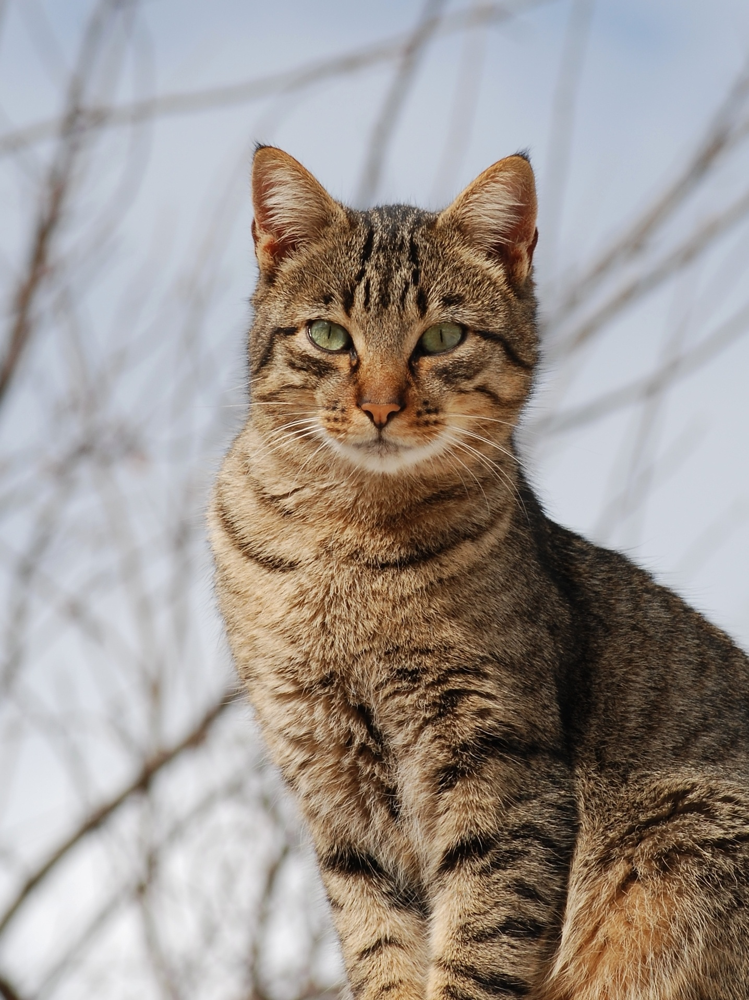


## Dropout


Sets some pixels in the image to zero.

```python
t = createTechnique("dropout",{"percentage":0.05})
img1 = t.apply(img)
cv2.imwrite("dropout.jpg",np.hstack([img,img1]))
```


## Elastic deformation


Applies elastic deformation as explained in the paper:  P. Simard, D. Steinkraus, and J. C. Platt. Best practices for convolutional neural networks applied to visual 
document analysis. Proceedings of the 12th International Conference on Document Analysis and Recognition (ICDAR'03) vol. 2, pp. 958--964. IEEE Computer Society. 2003.

```python
t = createTechnique("elastic",{"alpha":5,"sigma":0.05})
img1 = t.apply(img)
cv2.imwrite("elastic.jpg",np.hstack([img,img1]))
```

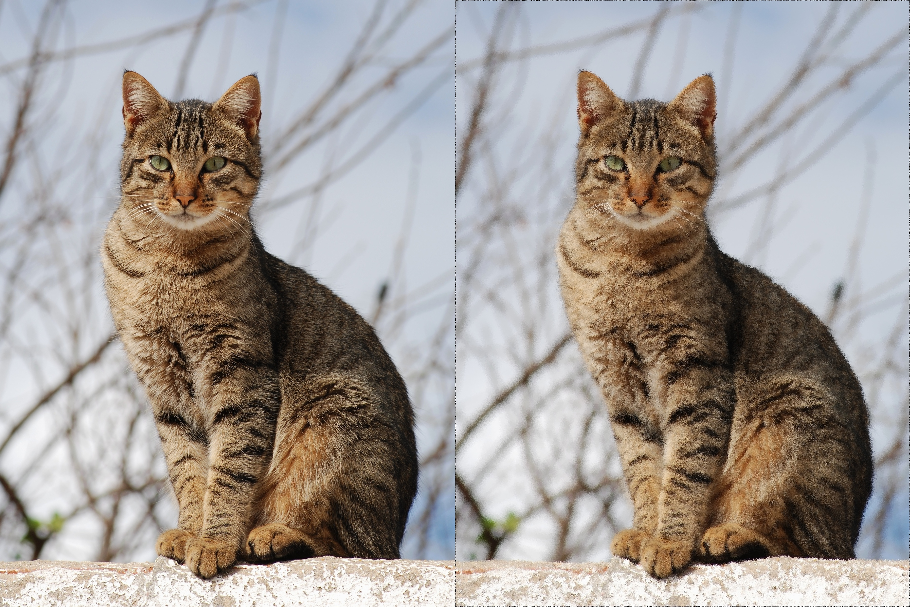


## Equalize histogram


Applies histogram equalization to the image.

```python
t = createTechnique("equalize_histogram",{})
img1 = t.apply(img)
cv2.imwrite("equalize.jpg",np.hstack([img,img1]))
```

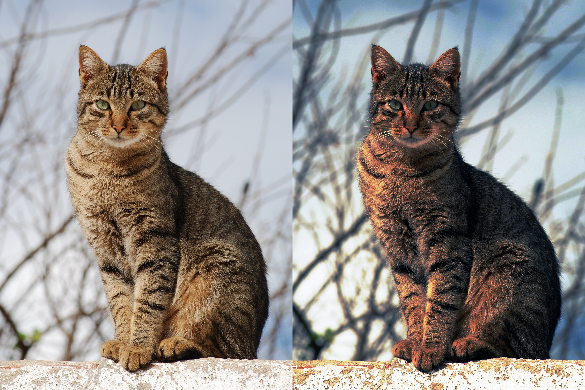


## Flip


Flips the image horizontally, vertically or both. 

```python
t = createTechnique("flip",{"flip":0})
t1 = createTechnique("flip",{"flip":1})
t2 = createTechnique("flip",{"flip":-1})
img1 = t.apply(img)
img2 = t1.apply(img)
img3 = t2.apply(img)
cv2.imwrite("flip.jpg",np.hstack([img,img1,img2,img3]))
```


## Gamma correction


Applies gamma correction to the image.

```python
t = createTechnique("gamma",{"gamma":1.5})
img1 = t.apply(img)
cv2.imwrite("gamma.jpg",np.hstack([img,img1]))
```

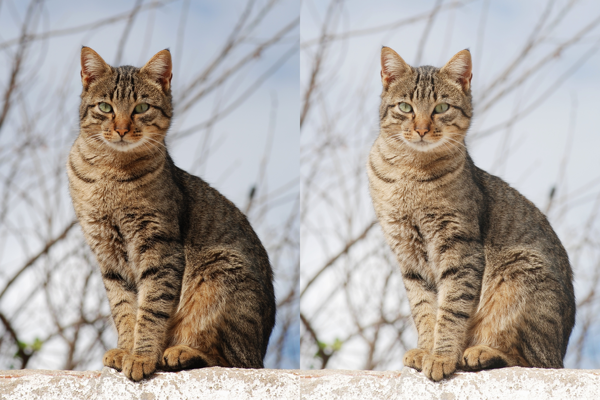


## Gaussian blurring


Blurs an image using a Gaussian filter.

```python
t = createTechnique("gaussian_blur", {"kernel" : 5})
img1 = t.apply(img)
cv2.imwrite("gaussian_blurring.jpg",np.hstack([img,img1]))
```


## Gaussian noise


Adds Gaussian noise to the image. 

```python
t = createTechnique("gaussian_noise", {"mean" : 0,"sigma":10})
img1 = t.apply(img)
cv2.imwrite("gaussian_noise.jpg",np.hstack([img,img1]))
```

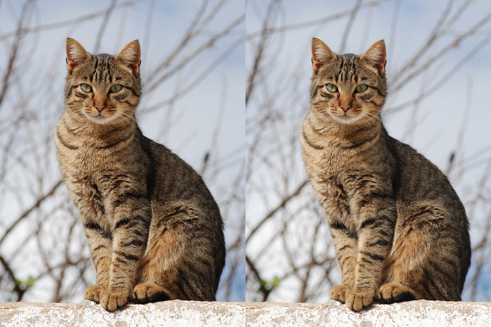


## Invert


Inverts all values in images, i.e. sets a pixel from value v to 255-v

```python
t = createTechnique("invert",{})
img1 = t.apply(img)
cv2.imwrite("invert.jpg",np.hstack([img,img1]))
```

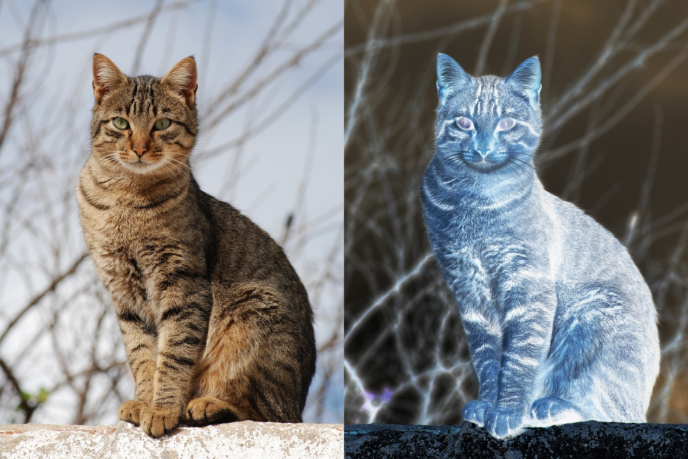


## Median blurring


Blurs an image using the median filter.

```python
t = createTechnique("median_blur", {"kernel" : 5})
img1 = t.apply(img)
cv2.imwrite("median_blurring.jpg",np.hstack([img,img1]))
```

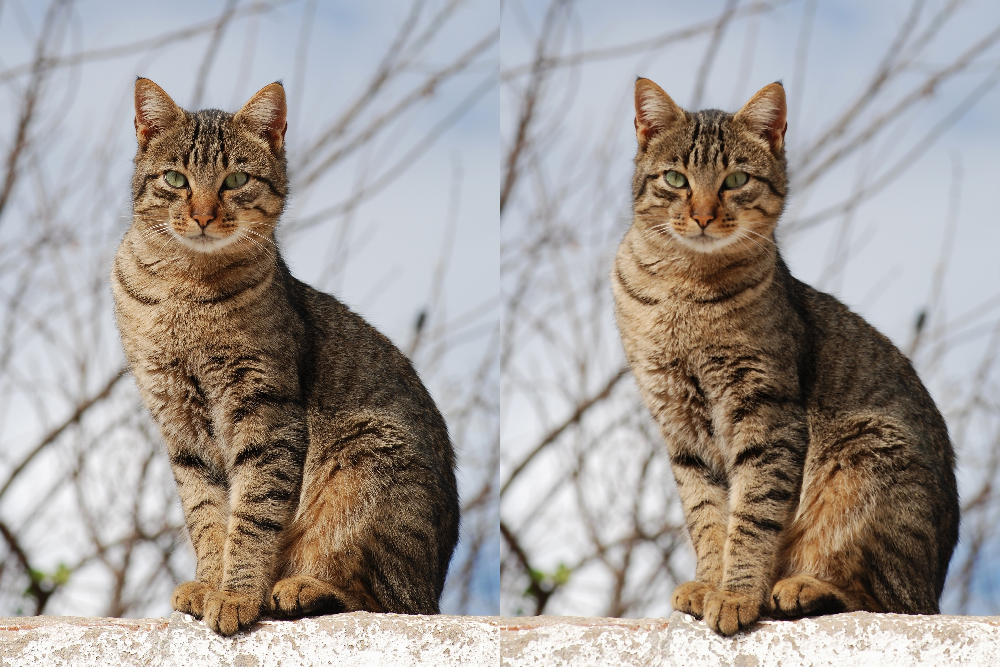


## None


This augmentation technique does not change the image. 

```python
t = createTechnique("none",{})
img1 = t.apply(img)
cv2.imwrite("none.jpg",np.hstack([img,img1]))
```


## Raise blue channel


Raises the values in the blue channel.

```python
t = createTechnique("raise_blue", {"power" : 0.9})
img1 = t.apply(img)
cv2.imwrite("raise_blue.jpg",np.hstack([img,img1]))
```


## Raise green channel


Raises the values in the green channel.

```python
t = createTechnique("raise_green", {"power" : 0.9})
img1 = t.apply(img)
cv2.imwrite("raise_green.jpg",np.hstack([img,img1]))
```

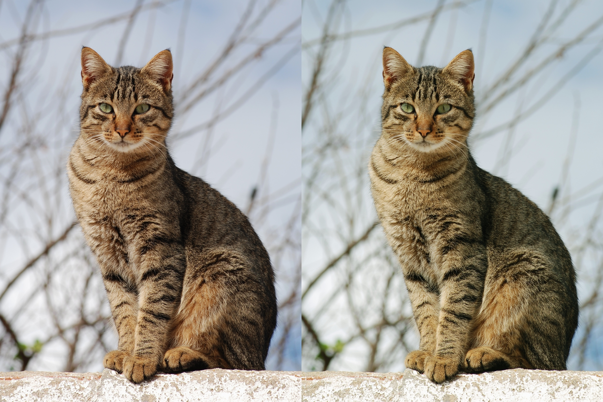

## Raise hue

Raises the hue value.

```python
t = createTechnique("raise_hue", {"power" : 0.9})
img1 = t.apply(img)
cv2.imwrite("raise_hue.jpg",np.hstack([img,img1]))
```

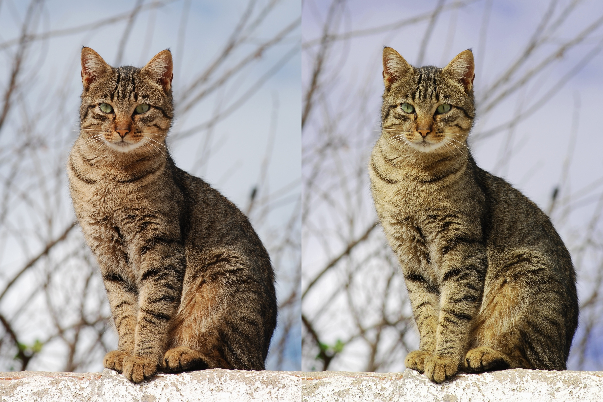

## Raise red channel

Raises the value in the red channel.

```python
t = createTechnique("raise_red", {"power" : 0.9})
img1 = t.apply(img)
cv2.imwrite("raise_red.jpg",np.hstack([img,img1]))
```

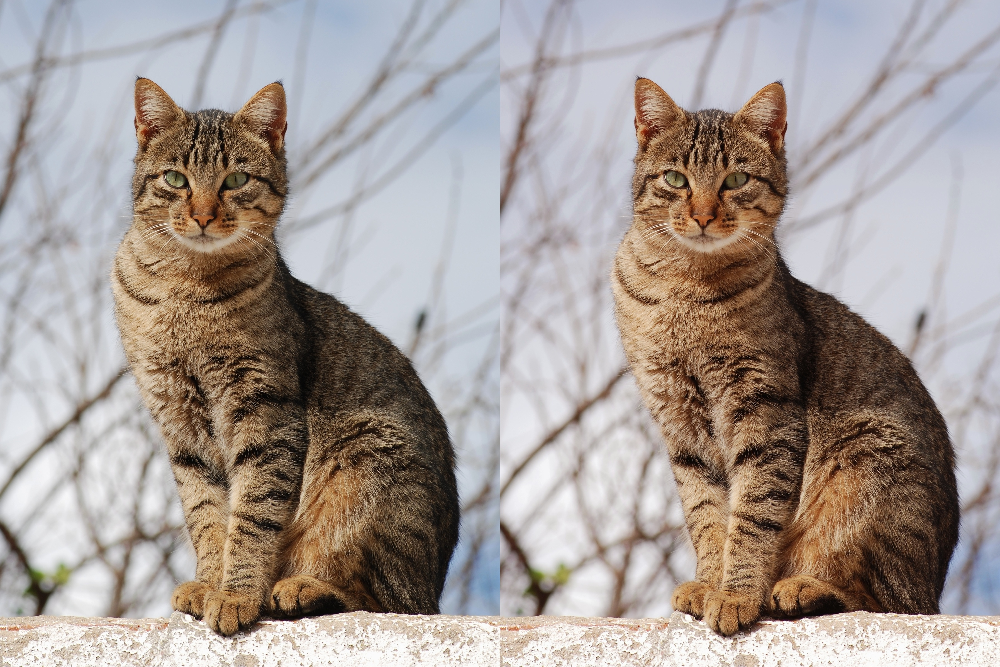

## Raise saturation

Raises the saturation.

```python
t = createTechnique("raise_saturation", {"power" : 0.9})
img1 = t.apply(img)
cv2.imwrite("raise_saturation.jpg",np.hstack([img,img1]))
```

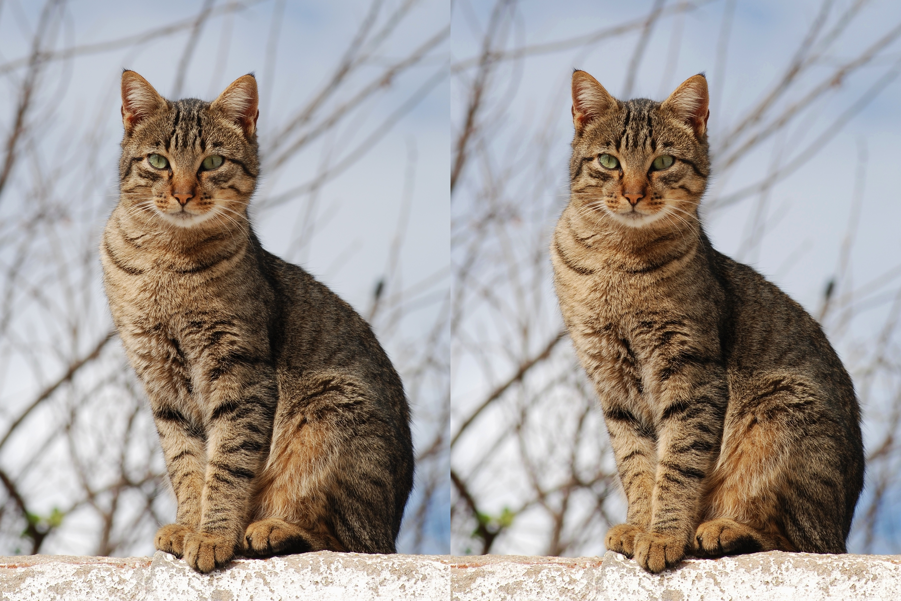

## Raise value


Raise the value of pixels.

```python
t = createTechnique("raise_value", {"power" : 0.9})
img1 = t.apply(img)
cv2.imwrite("raise_value.jpg",np.hstack([img,img1]))
```

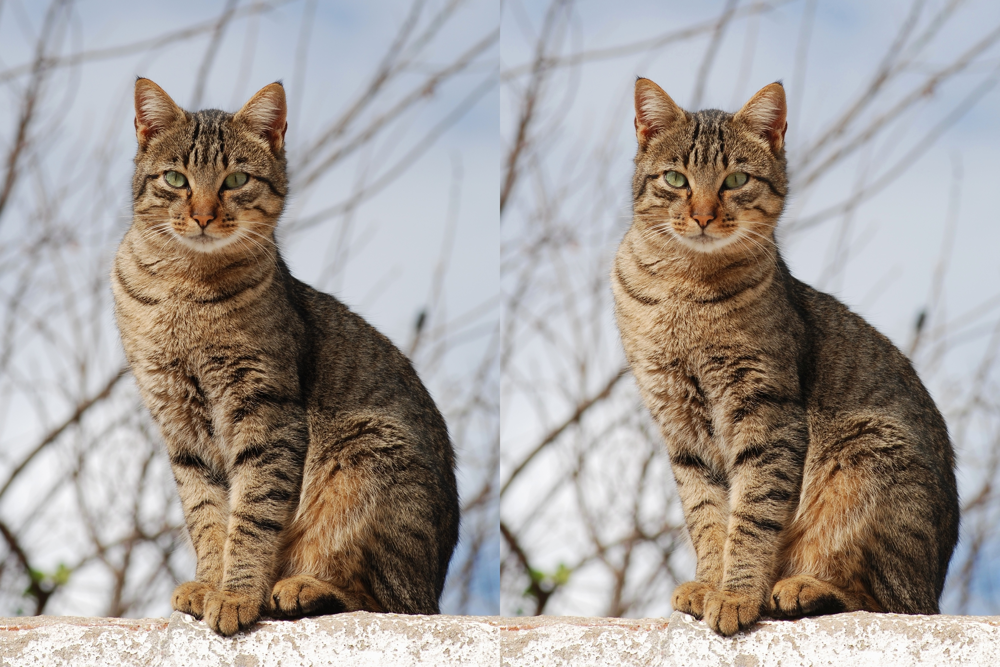


## Resize


Resizes the image.

```python
t = createTechnique("resize", {"percentage" : 0.9,"method":"INTER_NEAREST"})
img1 = t.apply(img)
cv2.imwrite("resize.jpg",img1)
```

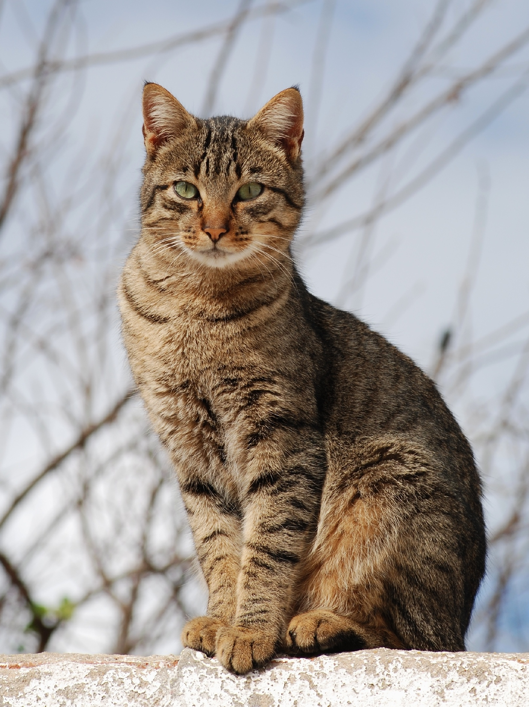

## Rotate


Rotates the image.

```python
t = createTechnique("rotate", {"angle" : 90})
img1 = t.apply(img)
cv2.imwrite("rotate.jpg",img1)
```

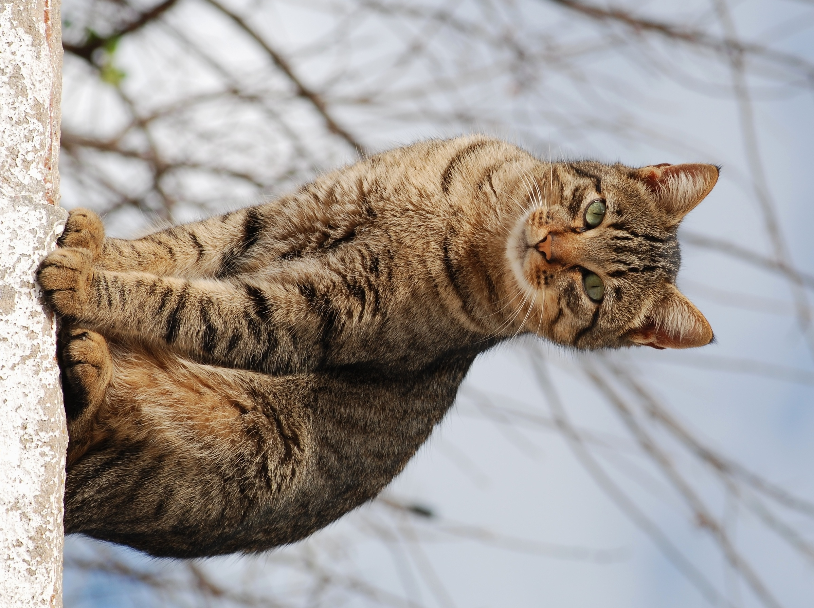

## Salt and Pepper


Adds salt and pepper noise to the image.

```python
t = createTechnique("salt_and_pepper", {"low" : 0,"up":25})
img1 = t.apply(img)
cv2.imwrite("salt_and_peper.jpg",np.hstack([img,img1]))
```

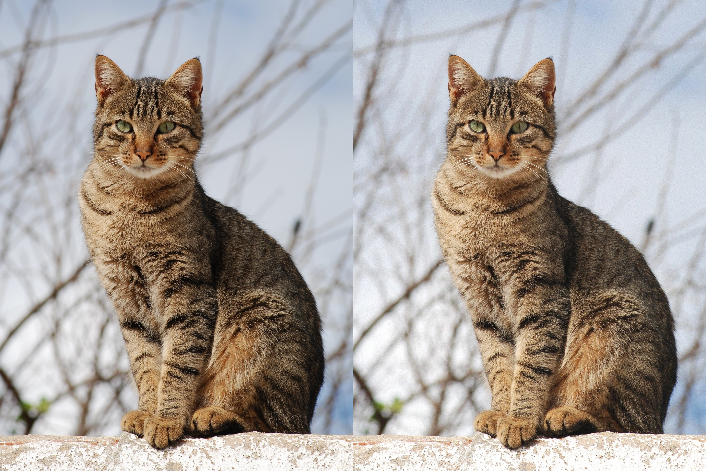

## Sharpen


Sharpens the image. 

```python
t = createTechnique("sharpen", {})
img1 = t.apply(img)
cv2.imwrite("sharpen.jpg",np.hstack([img,img1]))

```


## Shift channel


Shifts the channels of the image.

```python
t = createTechnique("shift_channel", {"shift":0.2})
img1 = t.apply(img)
cv2.imwrite("sharpen.jpg",np.hstack([img,img1]))
```


## Shearing


Shears the image.

```python
t = createTechnique("shearing", {"a":0.5})
img1 = t.apply(img)
cv2.imwrite("shearing.jpg",np.hstack([img,img1]))
```

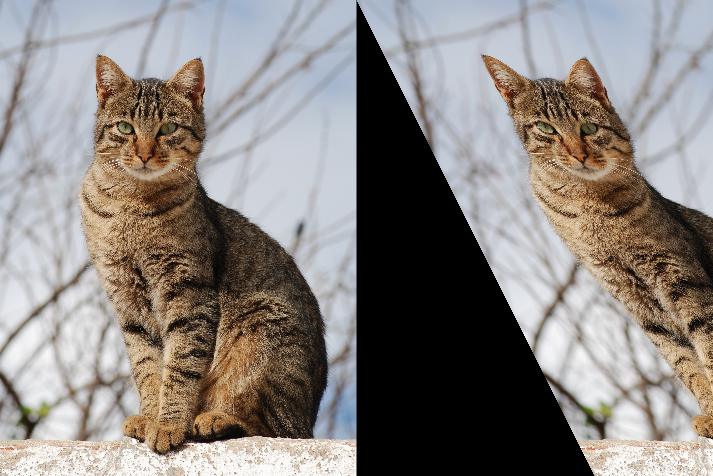

## Translation


Translates the image. 

```python
t = createTechnique("translation", {"x":10,"y":10})
img1 = t.apply(img)
cv2.imwrite("translation.jpg",np.hstack([img,img1]))
```

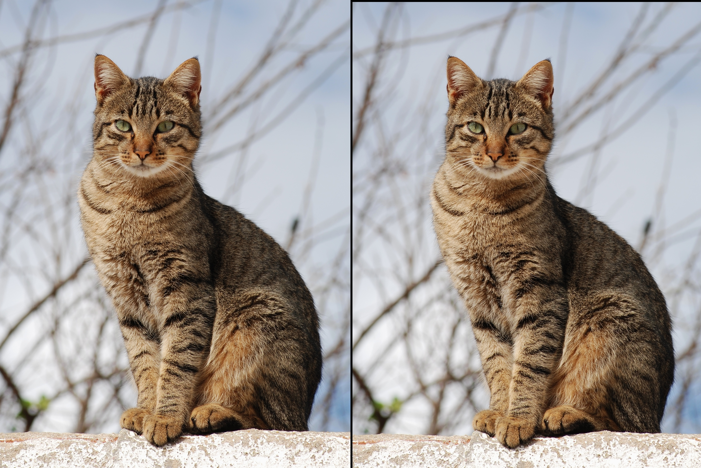

