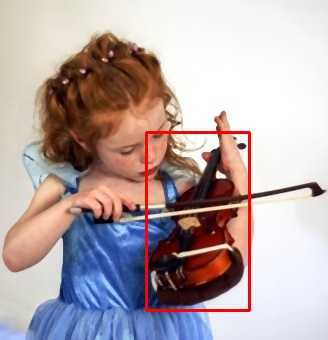
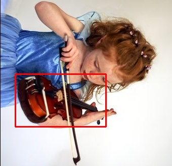
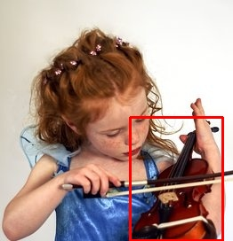

# Augmenting a dataset for object localization

In this section, we will use a small set of images annotated with the position a violin to show how the library can be used for image augmentation for object localization. The dataset and the configuration file that we will employ for this example is available at the [datasets folder](datasets/localization).

## PascalVOC-PascalVOC-Linear

In this example, we show how we can use the library for augmenting a dataset of images that are annotated using the PascalVOC format to generate a new dataset with the same format. In this example, we use four augmentation techniques: equalize histogram, median blur, rotation, and croping. The former two techniques do not modify the annotation of the image, but the latter two modify the annotation. 

The json file for this example (called violins_pascalvoc_pascalvoc_linear.json) is the following one. If you want to reproduce this example, you only need to change the value for the input_path and output_path parameters.   

```json
{
  "augmentation_techniques":[
    [
      "equalize_histogram",
      {
        
      }
    ],
    [
      "median_blur",
      {
        "kernel":"3"
      }
    ],
    [
      "rotate",
      {
        "angle":"90"
      }
    ],
    [
      "crop",
      {
        "startFrom":"TOPLEFT",
        "percentage":"0.8"
      }
    ]
  ],
  "generation_mode":"linear",
  "problem":"localization",
  "output_mode":"pascalvoc",
  "parameters":{
    "outputPath":"/home/joheras/Escritorio/augmented/"
  },
  "annotation_mode":"pascalvoc",
  "input_path":"/home/joheras/Escritorio/Research/CLoDeSeAugmentor/docs/datasets/localization/violins"
}
```

To run the augmentation process, the following command must be executed from the terminal.

```cmd
python augment.py -c violins_pascalvoc_pascalvoc_linear.json
```

We can see that the position of the violin is computed correctly in all the cases. 

Original image


Image with equalized histogram (non-altering technique)


Image with median blurring (non-altering technique)


Image with rotation (altering technique)


Image with croping (altering technique)

