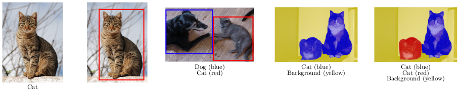
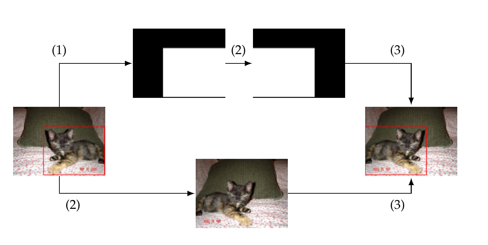
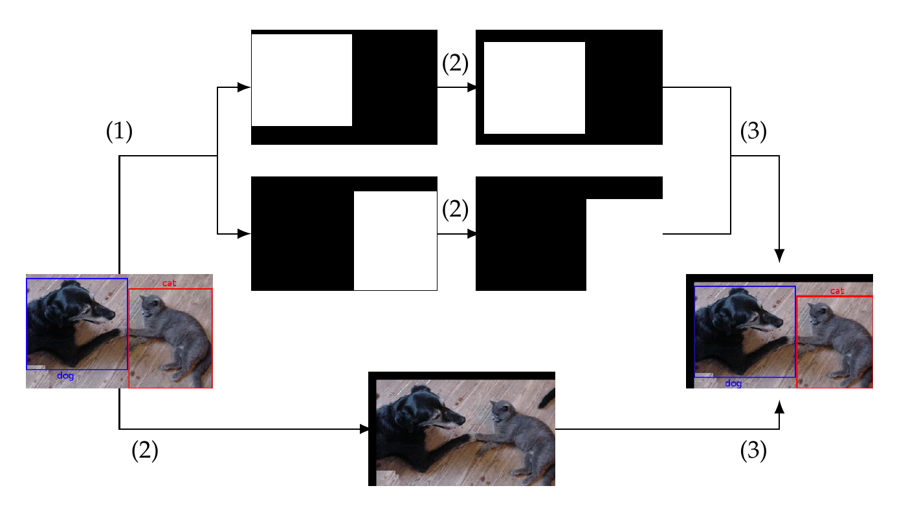
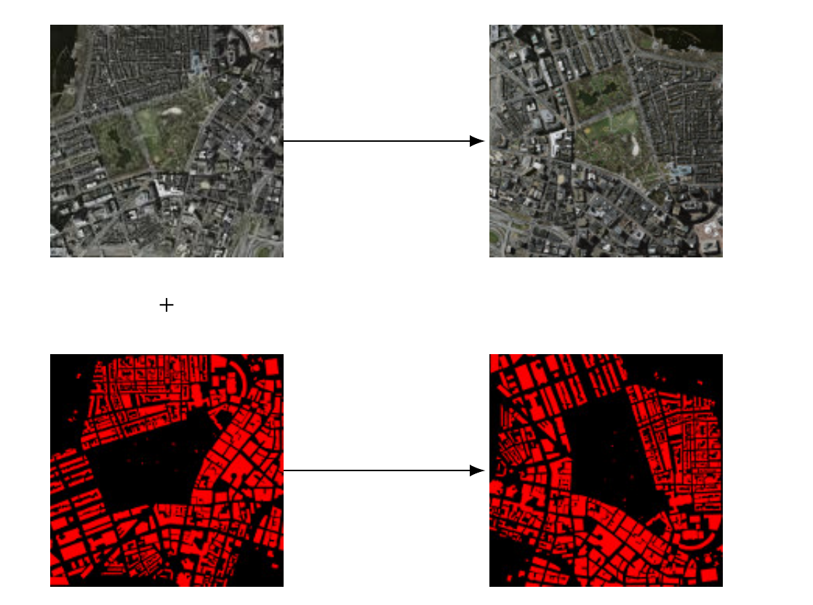

# Augmenting images for classification, localization, detection and semantic segmentation. 

In this section, we present an approach to augment images for the problems of object classification, localization, detection and semantic segmentation. First of all, it is important to understand how the images are annotated in each of these four problems. In the case of object classification, each image is labeled with a prefixed category; for object localization, a bounding box indicating the position of the object in the image is provided; for object detection, a list of bounding boxes and the category of the objects inside those boxes are given; finally, in semantic segmentation, each pixel of the image is labeled with the class of its enclosing object. An example of each kind of annotation is provided in the following figure. 

## Object classification

Data augmentation for object classification is the simplest case. This task consists in specifying a set of transformations for which an image classification problem is believed to be invariant; that is, transformations that do not change the class of the image. It is important to notice that data-augmentation techniques are problem-dependent and some transformations 
should not be applied; for example, applying a 180º rotation to an image of the digit 6 changes its class to the digit 9. 

For data augmentation in localization, detection, and segmentation, we consider the classical data augmentation techniques applied in object classification, and split them into two categories. The former category consists of the techniques that do not alter the annotation of the image; for example, changing the color palette of the image do not modify the position of an object. On the contrary, techniques that modify the annotation of the image belong to the latter category; for instance, rotation and translation belong to this category.  A list of all the transformations that have been considered and the corresponding category is available in the [main page](../README.md). 

Data augmentation for localization, detection, and segmentation using the techniques from the "non altering" category consists in applying the technique to the image and return the resulting image and the original annotation as result. The rest of this section is devoted to explain for each problem how the annotation can be automatically generated for the techniques of the "altering" category. 

## Object localization

In the case of object localization, the first step to automatically generate the label from an annotated image consists in generating a mask from the annotated bounding box --- i.e. a black image with a white rectangle indicating the position of the object. Subsequently, the transformation technique is applied to both the original image and the generated mask. Afterwards, from the transformed mask, the white region is simply located using basic contours properties, and the bounding box of the region is obtained. Finally, the transformed image is combined with the resulting bounding box to obtain the new annotated image. This process is depicted in the following figure.

## Object detection

The procedure for data augmentation in object detection relies on the one explained for object localization. Namely, the only difference is that instead of generating a unique mask, a list of masks is generated for each bounding box of the list of annotations. The rest of the procedure is the same, see the following figure. 

## Semantic segmentation 

Finally, we explain the procedure for the semantic segmentation problem. As we have previously explained, in this problem, given an image I, each pixel (i,j) of the image --- i.e. the pixel of row i and column j of I --- is labeled with the class of its enclosing object, this annotation is usually provided by means of an image A of the same size as the original one, where (i,j) provides the category of the pixel (i,j) of I, and where each pixel category is given by a different value. In this case, the idea to automatically generate a new annotated image consists in applying the same transformation to the original and the annotation image, the result will be the combination of the two transformed images, see the following figure.

