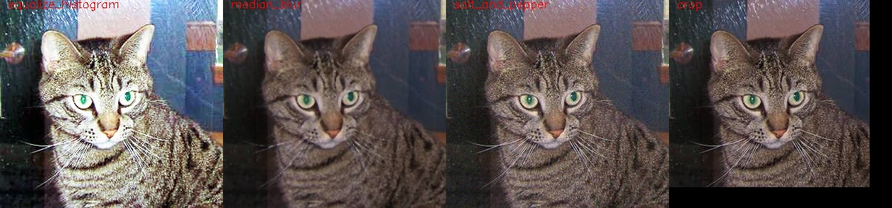

# Previsualization of augmentation techniques

Before running the augmentation process, it is possible to see the result of applying the augmentation techniques to a given image. 

Given a configuration file, for instance the [cats_dogs_folder_folder_linear.json](datasets/object_classification/cats_dogs_folder_folder_linear.json) and an image, for instance the [cat.1.jpg images](datasets/object_classification/cats/cat.1.jpg), it is possible to see the result of the augmentation techniques indicated in the configuration file applied to the images by executing the following command:

```
clodsa  cats_dogs_folder_folder_linear.json cat.1.jpg
```

This produces the following mosaic.



