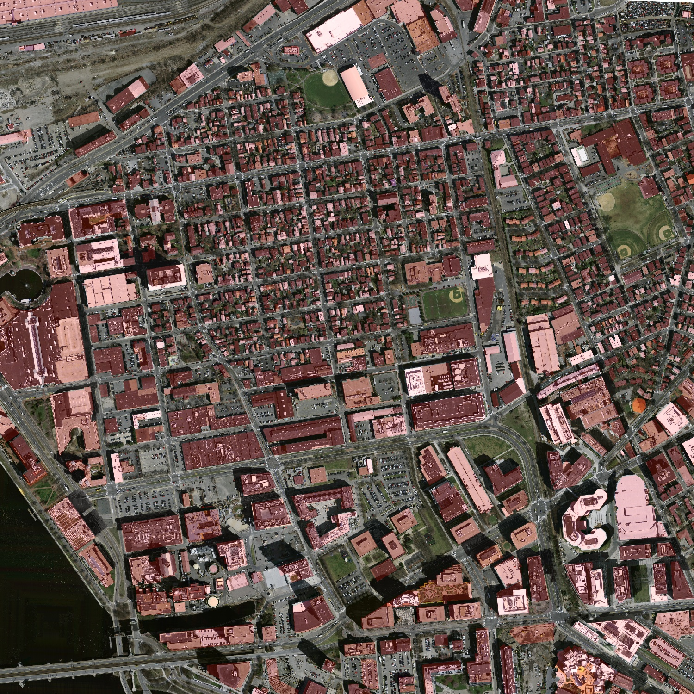
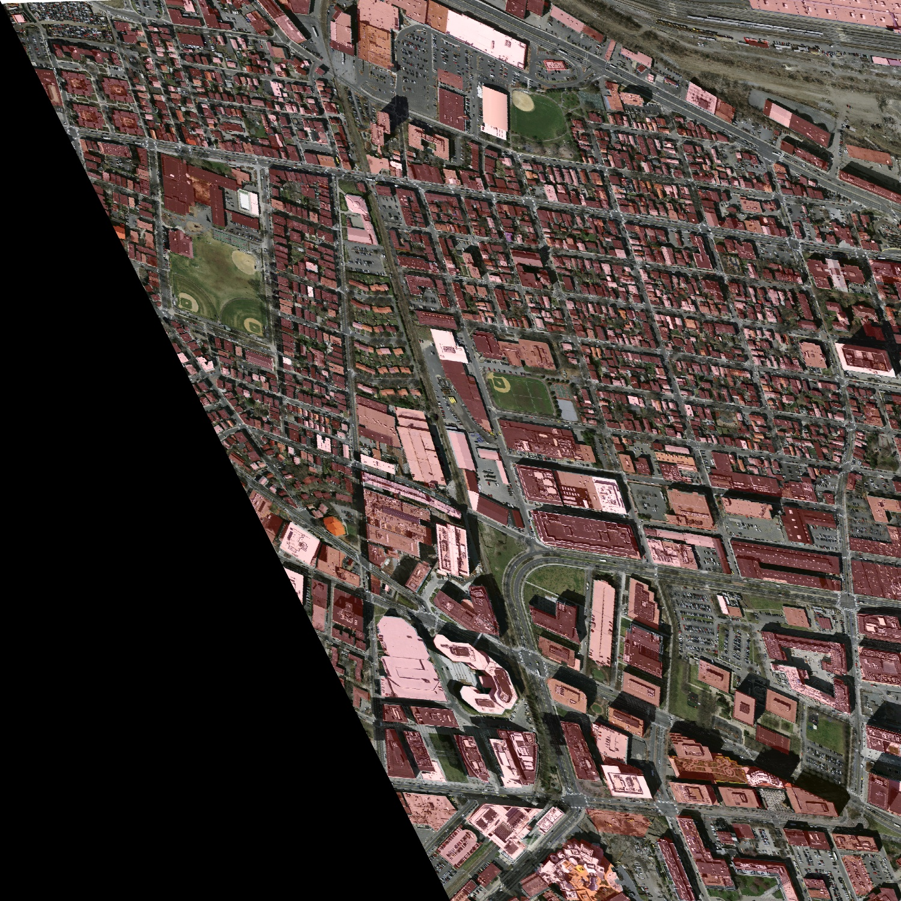
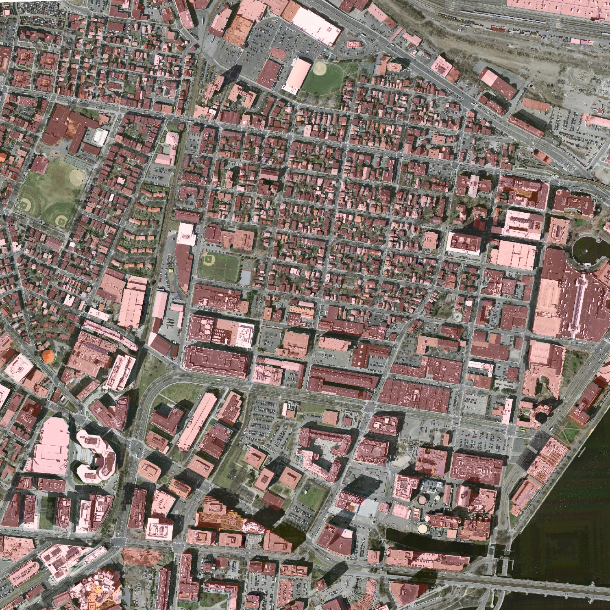
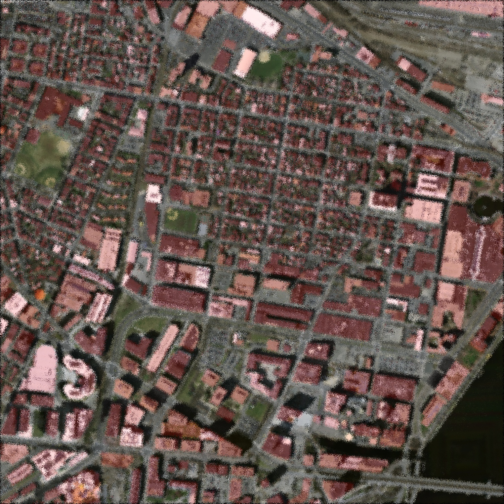

# Augmenting a dataset for semantic segmentation

In this section, we will use a small set of images from the [Road and Building Detection Datasets]() to show how the library can be used for image augmentation for semantic segmentation. The dataset and the configuration file that we will employ for this example is available at the [datasets folder](datasets/semantic_segmentation).

## Folder-Folder-Linear

In this example, we show how we can use the library for augmenting a dataset of images that are annotated using two folders (one for the images and one for the annotations) to generate a new dataset with the same format. In this example, we use four augmentation techniques: gamma correction, elastic deformation, flip, and shearing. The former technique do not modify the annotation of the image, but the latter three modify the annotation. 

The json file for this example (called building_folder_folder_linear.json) is the following one. If you want to reproduce this example, you only need to change the value for the input_path and output_path parameters.   

```json
{
  "augmentation_techniques":[
    [
      "flip",
      {
        "flip":"1"
      }
    ],
    [
      "shearing",
      {
        "a":"0.5"
      }
    ],
    [
      "gamma",
      {
        "gamma":"1.5"
      }
    ],
    [
      "elastic",
      {
        "sigma":"0.05",
        "alpha":"5"
      }
    ]
  ],
  "generation_mode":"linear",
  "problem":"semantic_segmentation",
  "output_mode":"folders",
  "parameters":{
    "labelsExtension":".tif",
    "outputPath":"/home/joheras/Escritorio/augmented/"
  },
  "annotation_mode":"folders",
  "input_path":"/home/joheras/Escritorio/Research/CLoDeSeAugmentor/docs/datasets/semantic_segmentation/buildings"
}
```

To run the augmentation process, the following command must be executed from the terminal.

```cmd
python augment.py -c building_folder_folder_linear.json
```

We can see that the annotation of the image is correct in the four cases. 

Original image, its annotation, and the addition (blending) of them


Image with flipping (altering technique)


Image with shearing (altering technique)


Image with gamma correction (non-altering technique)


Image with elastic deformation (altering technique)

